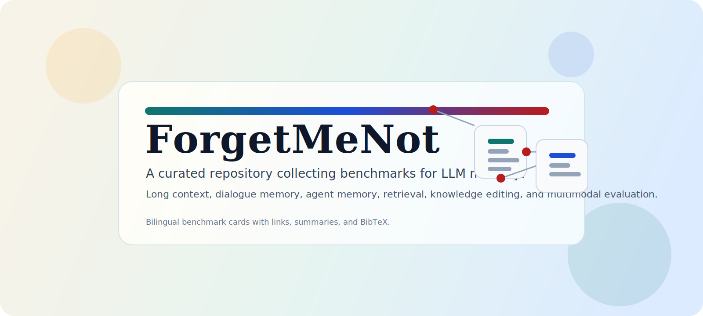

# ForgetMeNot

> A repository collecting benchmarks for LLM memory.

  

  <strong>A curated bilingual knowledge base of LLM memory benchmarks.</strong> 
  Long-context reasoning, dialogue memory, agent memory, RAG, continual learning, and multimodal long-horizon evaluation.

  
  
  
  
  
  

[English](./README.md) | [中文](./README_zh.md) | [English KB](./knowledge_base/en/README.md) | [中文知识库](./knowledge_base/zh/README.md)

ForgetMeNot is built as a bilingual, repository-style survey layer over a structured benchmark knowledge base. It is designed for researchers who need to move quickly from a benchmark family, to an index, to an individual benchmark card with links, abstracts, and BibTeX.

> [!NOTE]
> English is the default reading path. If you prefer the manually curated Chinese summaries, jump to `README_zh.md` or `knowledge_base/zh/README.md`.

## Why ForgetMeNot

- It organizes benchmark discovery around memory-oriented research questions rather than a flat paper list.
- It exposes a bilingual workflow: English for default navigation, Chinese for detailed curated notes.
- It links every benchmark entry to a structured card with URLs, scope, and full BibTeX.

## At a Glance

| Field | Value |
|---|---|
| Benchmark cards | 69 |
| Benchmark families | 7 |
| Default entry | `README.md` |
| Chinese mirror | `README_zh.md` and `knowledge_base/zh/` |

## Coverage Snapshot

| Family | Cards | Focus |
|---|---:|---|
| Long-Context Understanding and Reasoning | 18 | This family focuses on retrieval, synthesis, reasoning, and generation inside very long contexts such as long documents, code repositories, long dialogue histories, and structured long inputs. |
| Needle Retrieval and Diagnostic Probes | 7 | This family uses controllable synthetic setups to test whether a model can truly locate critical information in long contexts and to diagnose retrieval robustness, attention coverage, and multi-needle disambiguation. |
| Retrieval, Embeddings, and RAG | 11 | This family treats external corpora, indices, and retrievers as semantic memory, spanning long-document representation learning, end-to-end RAG pipelines, and faithfulness evaluation. |
| Multi-Session Dialogue Memory and Personalization | 7 | This family targets episodic memory across sessions, long-running user history, and dynamic personalization, with emphasis on cross-turn tracking and user-aware responses. |
| Agent Memory and Continual Learning | 12 | This family places memory inside agent tasks, environment interaction, and continual-learning settings, evaluating not only recall but also long-term decision quality, task transfer, and feedback accumulation. |
| Knowledge Editing and Semantic Memory Updates | 4 | This family evaluates how well a model updates semantic memory after a new fact is written, including locality, generalization, ripple effects, and consistency. |
| Multimodal Long-Horizon Memory and Retrieval-Reasoning | 10 | This family extends long-horizon memory to PDFs, image pools, and long videos, emphasizing evidence localization and integration over large multimodal contexts. |

## Reading Paths

1. **Survey first**: start from the family index below, then open the English card that best matches your task.
2. **Chinese notes first**: jump to `README_zh.md` or `knowledge_base/zh/README.md` for manually curated Chinese summaries.
3. **Source-first verification**: use the benchmark card to open the original paper, repo, or project page and inspect the full BibTeX.

## Repository Layout

- `README.md`: English landing page and high-level index.
- `README_zh.md`: Chinese landing page and high-level index.
- `assets/cover.svg`: repository banner used by the landing pages.
- `knowledge_base/en/`: English benchmark cards.
- `knowledge_base/zh/`: Chinese benchmark cards.
- `source_catalog/`: internal structured source cards used to regenerate the bilingual knowledge base.

## Table of Contents

- [Long-Context Understanding and Reasoning](#long-context-understanding-and-reasoning)
- [Needle Retrieval and Diagnostic Probes](#needle-retrieval-and-diagnostic-probes)
- [Retrieval, Embeddings, and RAG](#retrieval-embeddings-and-rag)
- [Multi-Session Dialogue Memory and Personalization](#multi-session-dialogue-memory-and-personalization)
- [Agent Memory and Continual Learning](#agent-memory-and-continual-learning)
- [Knowledge Editing and Semantic Memory Updates](#knowledge-editing-and-semantic-memory-updates)
- [Multimodal Long-Horizon Memory and Retrieval-Reasoning](#multimodal-long-horizon-memory-and-retrieval-reasoning)

## Long-Context Understanding and Reasoning

This family focuses on retrieval, synthesis, reasoning, and generation inside very long contexts such as long documents, code repositories, long dialogue histories, and structured long inputs.

- [AcademicEval](knowledge_base/en/01_long_context/academiceval.md) ([CN](knowledge_base/zh/01_long_context/academiceval.md)): A live long-context generation benchmark built from recent arXiv papers for title, abstract, introduction, and related-work writing tasks.
- [Ada-LEval](knowledge_base/en/01_long_context/ada-leval.md) ([CN](knowledge_base/zh/01_long_context/ada-leval.md)): A length-adaptable benchmark with TSort and BestAnswer for controllable long-context evaluation.
- [BAMBOO](knowledge_base/en/01_long_context/bamboo.md) ([CN](knowledge_base/zh/01_long_context/bamboo.md)): A contamination-aware long-text benchmark spanning QA, hallucination detection, ranking, language modeling, and code completion.
- [∞Bench](knowledge_base/en/01_long_context/infinitebench.md) ([CN](knowledge_base/zh/01_long_context/infinitebench.md)): A bilingual benchmark that mixes synthetic and realistic tasks with average context length beyond 100k tokens.
- [L-CiteEval](knowledge_base/en/01_long_context/l-citeeval.md) ([CN](knowledge_base/zh/01_long_context/l-citeeval.md)): A citation-grounded long-context benchmark that scores both answer quality and citation precision and recall.
- [L-Eval](knowledge_base/en/01_long_context/l-eval.md) ([CN](knowledge_base/zh/01_long_context/l-eval.md)): A standardized long-context suite with 20 tasks, 508 long documents, and 2,000+ human-labeled query-response pairs.
- [LongBench-E](knowledge_base/en/01_long_context/longbench-e.md) ([CN](knowledge_base/zh/01_long_context/longbench-e.md)): A uniform-length evaluation variant of LongBench designed to decouple true long-context ability from short-context bias.
- [LongBench Pro](knowledge_base/en/01_long_context/longbench-pro.md) ([CN](knowledge_base/zh/01_long_context/longbench-pro.md)): A more realistic bilingual long-context benchmark with 1,500 naturally occurring long samples and a fine-grained taxonomy.
- [LongBench v2](knowledge_base/en/01_long_context/longbench-v2.md) ([CN](knowledge_base/zh/01_long_context/longbench-v2.md)): A realistic multitask benchmark with 8k-to-2M-word contexts targeting deep understanding and reasoning.
- [LongBench](knowledge_base/en/01_long_context/longbench.md) ([CN](knowledge_base/zh/01_long_context/longbench.md)): The first bilingual multitask long-context benchmark covering QA, summarization, few-shot learning, synthetic tasks, and code completion.
- [LongBioBench](knowledge_base/en/01_long_context/longbiobench.md) ([CN](knowledge_base/zh/01_long_context/longbiobench.md)): A controllable long-context benchmark built from coherent biographical narratives to avoid shortcut-prone needle-style setups.
- [LooGLE v2](knowledge_base/en/01_long_context/loogle-v2.md) ([CN](knowledge_base/zh/01_long_context/loogle-v2.md)): A real-world long-dependency benchmark targeting practical domains such as finance, law, code, and games.
- [LooGLE](knowledge_base/en/01_long_context/loogle.md) ([CN](knowledge_base/zh/01_long_context/loogle.md)): A long-document benchmark built from recent real-world documents with both automatic and human-written QA.
- [Loong](knowledge_base/en/01_long_context/loong.md) ([CN](knowledge_base/zh/01_long_context/loong.md)): An extended multi-document QA benchmark where every document is relevant, so missing any document hurts performance.
- [Ref-Long](knowledge_base/en/01_long_context/ref-long.md) ([CN](knowledge_base/zh/01_long_context/ref-long.md)): A referencing-oriented long-context benchmark that asks models to identify which documents point to a target key.
- [RULER](knowledge_base/en/01_long_context/ruler.md) ([CN](knowledge_base/zh/01_long_context/ruler.md)): A controllable long-context diagnostic suite covering retrieval, aggregation, multi-hop tracing, and QA.
- [SCROLLS](knowledge_base/en/01_long_context/scrolls.md) ([CN](knowledge_base/zh/01_long_context/scrolls.md)): A standardized long-text benchmark spanning summarization, QA, NLI, and other long-sequence tasks.
- [ZeroSCROLLS](knowledge_base/en/01_long_context/zeroscrolls.md) ([CN](knowledge_base/zh/01_long_context/zeroscrolls.md)): A zero-shot long-text benchmark derived from SCROLLS and additional datasets with tiny validation sets and no training split.

## Needle Retrieval and Diagnostic Probes

This family uses controllable synthetic setups to test whether a model can truly locate critical information in long contexts and to diagnose retrieval robustness, attention coverage, and multi-needle disambiguation.

- [BABILong](knowledge_base/en/02_needle_and_diagnostics/babilong.md) ([CN](knowledge_base/zh/02_needle_and_diagnostics/babilong.md)): A reasoning-in-a-haystack benchmark that embeds bAbI-style reasoning tasks inside ultra-long documents.
- [GraphWalks](knowledge_base/en/02_needle_and_diagnostics/graphwalks.md) ([CN](knowledge_base/zh/02_needle_and_diagnostics/graphwalks.md)): An edge-list-based graph reasoning dataset for long-context multi-hop search and traversal operations.
- [MRCR](knowledge_base/en/02_needle_and_diagnostics/mrcr.md) ([CN](knowledge_base/zh/02_needle_and_diagnostics/mrcr.md)): A multiple-needle long-context benchmark focused on multi-round retrieval and distinguishing similar earlier requests.
- [NeedleBench](knowledge_base/en/02_needle_and_diagnostics/needlebench.md) ([CN](knowledge_base/zh/02_needle_and_diagnostics/needlebench.md)): A synthetic bilingual benchmark that systematically varies needle depth, density, and reasoning difficulty.
- [Needle-in-a-Haystack](knowledge_base/en/02_needle_and_diagnostics/niah.md) ([CN](knowledge_base/zh/02_needle_and_diagnostics/niah.md)): The canonical needle-in-a-haystack stress test that inserts key facts into long contexts and asks models to recover them.
- [Passkey Retrieval](knowledge_base/en/02_needle_and_diagnostics/passkey-retrieval.md) ([CN](knowledge_base/zh/02_needle_and_diagnostics/passkey-retrieval.md)): A classic passkey recall setup, originating from Landmark Attention, for testing retrieval of a hidden random key.
- [Phonebook](knowledge_base/en/02_needle_and_diagnostics/phonebook.md) ([CN](knowledge_base/zh/02_needle_and_diagnostics/phonebook.md)): A task family that measures long-context retrieval by querying names and phone numbers from large lookup tables.

## Retrieval, Embeddings, and RAG

This family treats external corpora, indices, and retrievers as semantic memory, spanning long-document representation learning, end-to-end RAG pipelines, and faithfulness evaluation.

- [BEIR](knowledge_base/en/03_retrieval_rag/beir.md) ([CN](knowledge_base/zh/03_retrieval_rag/beir.md)): A heterogeneous zero-shot retrieval benchmark for evaluating generalization across 18 IR datasets.
- [GraphRAG-Bench](knowledge_base/en/03_retrieval_rag/graphrag-bench.md) ([CN](knowledge_base/zh/03_retrieval_rag/graphrag-bench.md)): A full-pipeline GraphRAG benchmark over textbook corpora that evaluates construction, retrieval, generation, and reasoning coherence.
- [KILT](knowledge_base/en/03_retrieval_rag/kilt.md) ([CN](knowledge_base/zh/03_retrieval_rag/kilt.md)): A knowledge-intensive benchmark that unifies multiple tasks over a shared Wikipedia snapshot and provenance evaluation.
- [LaRA](knowledge_base/en/03_retrieval_rag/lara.md) ([CN](knowledge_base/zh/03_retrieval_rag/lara.md)): A benchmark for comparing long-context LLMs and RAG systems under the same realistic QA settings.
- [LMEB](knowledge_base/en/03_retrieval_rag/lmeb.md) ([CN](knowledge_base/zh/03_retrieval_rag/lmeb.md)): A long-horizon memory embedding benchmark covering episodic, dialogue, semantic, and procedural retrieval.
- [LoCoV1](knowledge_base/en/03_retrieval_rag/locov1.md) ([CN](knowledge_base/zh/03_retrieval_rag/locov1.md)): A long-document retrieval benchmark for encoders where chunking is often ineffective or impossible.
- [LongEmbed](knowledge_base/en/03_retrieval_rag/longembed.md) ([CN](knowledge_base/zh/03_retrieval_rag/longembed.md)): A benchmark for extending embedding models from short contexts to long-context retrieval up to 32k tokens.
- [MTEB](knowledge_base/en/03_retrieval_rag/mteb.md) ([CN](knowledge_base/zh/03_retrieval_rag/mteb.md)): A large-scale general text-embedding benchmark covering multiple tasks, datasets, and languages.
- [RAGBench](knowledge_base/en/03_retrieval_rag/ragbench.md) ([CN](knowledge_base/zh/03_retrieval_rag/ragbench.md)): An explainable end-to-end RAG benchmark with large-scale industrial-style data and annotated failure modes.
- [RAGTruth](knowledge_base/en/03_retrieval_rag/ragtruth.md) ([CN](knowledge_base/zh/03_retrieval_rag/ragtruth.md)): A hallucination corpus for RAG that provides case-level and word-level faithfulness annotations.
- [T2-RAGBench](knowledge_base/en/03_retrieval_rag/t2-ragbench.md) ([CN](knowledge_base/zh/03_retrieval_rag/t2-ragbench.md)): A text-and-table RAG benchmark with 23,088 context-independent triples for retrieval plus numerical reasoning.

## Multi-Session Dialogue Memory and Personalization

This family targets episodic memory across sessions, long-running user history, and dynamic personalization, with emphasis on cross-turn tracking and user-aware responses.

- [DialSim](knowledge_base/en/04_dialogue_memory/dialsim.md) ([CN](knowledge_base/zh/04_dialogue_memory/dialsim.md)): A dialogue simulator for long multi-party conversations, including very long contexts and unanswerable cases.
- [LoCoMo](knowledge_base/en/04_dialogue_memory/locomo.md) ([CN](knowledge_base/zh/04_dialogue_memory/locomo.md)): A benchmark of very long-term conversational memory with event-grounded multi-session dialogues.
- [LongMemEval](knowledge_base/en/04_dialogue_memory/longmemeval.md) ([CN](knowledge_base/zh/04_dialogue_memory/longmemeval.md)): An interactive benchmark that embeds 500 questions into expandable chat histories for long-term assistant memory.
- [Mem-Gallery](knowledge_base/en/04_dialogue_memory/mem-gallery.md) ([CN](knowledge_base/zh/04_dialogue_memory/mem-gallery.md)): A multimodal long-term conversational memory benchmark for MLLM agents across multi-session interactions.
- [PersonaMem](knowledge_base/en/04_dialogue_memory/personamem.md) ([CN](knowledge_base/zh/04_dialogue_memory/personamem.md)): A dynamic personalization benchmark that evaluates whether LLMs track evolving user traits and preferences over time.
- [RealMem](knowledge_base/en/04_dialogue_memory/realmem.md) ([CN](knowledge_base/zh/04_dialogue_memory/realmem.md)): A benchmark for project-oriented real-world memory interactions with cross-session dialogues and evolving goals.
- [RealTalk](knowledge_base/en/04_dialogue_memory/realtalk.md) ([CN](knowledge_base/zh/04_dialogue_memory/realtalk.md)): A 21-day real-world conversation dataset and benchmark for long-term open-domain dialogue memory.

## Agent Memory and Continual Learning

This family places memory inside agent tasks, environment interaction, and continual-learning settings, evaluating not only recall but also long-term decision quality, task transfer, and feedback accumulation.

- [AMA-Bench](knowledge_base/en/05_agent_memory/ama-bench.md) ([CN](knowledge_base/zh/05_agent_memory/ama-bench.md)): A long-horizon agent-memory benchmark built from real trajectories and scalable synthetic traces.
- [CLLE](knowledge_base/en/05_agent_memory/clle.md) ([CN](knowledge_base/zh/05_agent_memory/clle.md)): A benchmark for continual language learning in multilingual machine translation.
- [CoIN](knowledge_base/en/05_agent_memory/coin.md) ([CN](knowledge_base/zh/05_agent_memory/coin.md)): A multimodal continual instruction-tuning benchmark that measures instruction following and retained knowledge under drift.
- [GoodAI LTM Benchmark](knowledge_base/en/05_agent_memory/goodai-ltm-benchmark.md) ([CN](knowledge_base/zh/05_agent_memory/goodai-ltm-benchmark.md)): A dynamic conversational benchmark for long-term memory, continual learning, and information integration in agents.
- [LifelongAgentBench](knowledge_base/en/05_agent_memory/lifelongagentbench.md) ([CN](knowledge_base/zh/05_agent_memory/lifelongagentbench.md)): A unified benchmark that evaluates LLM agents as lifelong learners across evolving tasks.
- [LOCA-bench](knowledge_base/en/05_agent_memory/loca-bench.md) ([CN](knowledge_base/zh/05_agent_memory/loca-bench.md)): A controllable benchmark for language agents under extreme context growth in interactive environments.
- [MemBench](knowledge_base/en/05_agent_memory/membench.md) ([CN](knowledge_base/zh/05_agent_memory/membench.md)): A comprehensive benchmark that separates factual and reflective memory in LLM-based agents.
- [MemoryAgentBench](knowledge_base/en/05_agent_memory/memoryagentbench.md) ([CN](knowledge_base/zh/05_agent_memory/memoryagentbench.md)): A benchmark that reformats memory-agent evaluation into incremental multi-turn interactions.
- [MemoryArena](knowledge_base/en/05_agent_memory/memoryarena.md) ([CN](knowledge_base/zh/05_agent_memory/memoryarena.md)): A benchmark for agent memory in interdependent multi-session agentic tasks.
- [MemoryBench](knowledge_base/en/05_agent_memory/memorybench.md) ([CN](knowledge_base/zh/05_agent_memory/memorybench.md)): A benchmark for memory and continual learning in LLM systems driven by simulated user feedback.
- [MemoryCD](knowledge_base/en/05_agent_memory/memorycd.md) ([CN](knowledge_base/zh/05_agent_memory/memorycd.md)): A user-centric cross-domain benchmark for lifelong personalization and long-context user memory in LLM agents.
- [Rubric Feedback Bench](knowledge_base/en/05_agent_memory/rubric-feedback-bench.md) ([CN](knowledge_base/zh/05_agent_memory/rubric-feedback-bench.md)): A benchmark for turning iterative feedback into retrievable rules or memory tools.

## Knowledge Editing and Semantic Memory Updates

This family evaluates how well a model updates semantic memory after a new fact is written, including locality, generalization, ripple effects, and consistency.

- [CounterFact](knowledge_base/en/06_knowledge_editing/counterfact.md) ([CN](knowledge_base/zh/06_knowledge_editing/counterfact.md)): A classic counterfactual dataset introduced by ROME for evaluating factual editing efficacy, specificity, and generalization.
- [MQuAKE](knowledge_base/en/06_knowledge_editing/mquake.md) ([CN](knowledge_base/zh/06_knowledge_editing/mquake.md)): A multi-hop benchmark that tests whether factual edits propagate correctly through related reasoning chains.
- [QAEdit + WILD](knowledge_base/en/06_knowledge_editing/qaeedit-wild.md) ([CN](knowledge_base/zh/06_knowledge_editing/qaeedit-wild.md)): A realistic editing benchmark and evaluation framework that revisits model editing in the wild.
- [ZsRE](knowledge_base/en/06_knowledge_editing/zsre.md) ([CN](knowledge_base/zh/06_knowledge_editing/zsre.md)): A zero-shot relation extraction dataset often repurposed as a context-free QA editing benchmark.

## Multimodal Long-Horizon Memory and Retrieval-Reasoning

This family extends long-horizon memory to PDFs, image pools, and long videos, emphasizing evidence localization and integration over large multimodal contexts.

- [DocHaystack](knowledge_base/en/07_multimodal/dochaystack.md) ([CN](knowledge_base/zh/07_multimodal/dochaystack.md)): A visual document reasoning benchmark over piles of up to 1,000 documents.
- [Ego4D Episodic Memory](knowledge_base/en/07_multimodal/ego4d-episodic-memory.md) ([CN](knowledge_base/zh/07_multimodal/ego4d-episodic-memory.md)): The official Ego4D task for making past egocentric video queryable and temporally localizable.
- [InfoHaystack](knowledge_base/en/07_multimodal/infohaystack.md) ([CN](knowledge_base/zh/07_multimodal/infohaystack.md)): A large-pool visual document retrieval benchmark introduced alongside DocHaystack.
- [LongVideoBench](knowledge_base/en/07_multimodal/longvideobench.md) ([CN](knowledge_base/zh/07_multimodal/longvideobench.md)): An interleaved video-language long-context benchmark with videos up to around one hour.
- [MM-NIAH](knowledge_base/en/07_multimodal/mm-niah.md) ([CN](knowledge_base/zh/07_multimodal/mm-niah.md)): A long multimodal document needle benchmark with retrieval, counting, and reasoning tasks.
- [MMLongBench-Doc](knowledge_base/en/07_multimodal/mmlongbench-doc.md) ([CN](knowledge_base/zh/07_multimodal/mmlongbench-doc.md)): A multimodal long-document benchmark built on long PDFs with text, figures, and tables.
- [MMNeedle](knowledge_base/en/07_multimodal/mmneedle.md) ([CN](knowledge_base/zh/07_multimodal/mmneedle.md)): A multi-image needle benchmark that stresses sub-image localization and negative-sample hallucination.
- [MultiHaystack](knowledge_base/en/07_multimodal/multihaystack.md) ([CN](knowledge_base/zh/07_multimodal/multihaystack.md)): A multimodal retrieval-and-reasoning benchmark over 46k images, videos, and documents.
- [Video-MME](knowledge_base/en/07_multimodal/video-mme.md) ([CN](knowledge_base/zh/07_multimodal/video-mme.md)): A comprehensive video MLLM benchmark spanning domains, durations, and 2,700 human-labeled QA pairs.
- [Visual Haystacks](knowledge_base/en/07_multimodal/visual-haystacks.md) ([CN](knowledge_base/zh/07_multimodal/visual-haystacks.md)): A vision-centric needle-in-a-haystack benchmark for retrieval and reasoning over large image sets.
